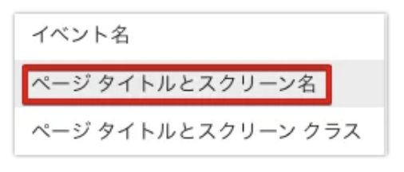

#　グーグルタグマネージャー（以下：GTM）とグーグルアナリティクス４（以下：GA4）を使った設定方法
WordpressのGoogle公式プラグイン「[Site Kit by Google](https://sitekit.withgoogle.com)」を使用する場合は[別の方法](https://www.onamae.com/column/blog/33/)があります。

**プライバシーポリシーについて**
サイト内でアクセス解析をしていることを表記しておく必要があります。
> 当サイトでは、Googleによるアクセス解析ツール「Googleアナリティクス」を使用しています。このGoogleアナリティクスはデータの収集のためにCookieを使用しています。このデータは匿名で収集されており、個人を特定するものではありません。
この機能はCookieを無効にすることで収集を拒否することが出来ますので、お使いのブラウザの設定をご確認ください。この規約に関しての詳細は[Googleアナリティクスサービス利用規約のページ](https://marketingplatform.google.com/about/analytics/terms/jp/)や[Googleポリシーと規約ページ](https://policies.google.com/technologies/ads?hl=ja)をご覧ください。

## GA4の設定

1. [GA4にアクセス](https://analytics.google.com)する。（初めての場合はGoogleアカウントでログイン。 or Googleアカウントを持っていない場合は作成画面になります。）
2. **アカウントを作成** アカウント名を入力。任意のアカウント名を入力しましょう。Googleアカウントは複数作れるため、どのアカウントなのかわかりやすい名称を設定してください。
3. **データ共有オプションの設定** データ共有オプションは説明を読み、特に不要と判断するものがなければ、推奨されている項目にチェックマークを入れます。
4. **GA4プロパティの設定** あとから識別しやすいように任意のプロパティ名を設定し、レポートタイプを「日本」、通貨を「日本円」に設定しましょう。
5. **ウェブサイトのURLを入力** アクセス解析を予定している「ウェブサイトのURL」を入力します。「Googleアナリティクス4とユニバーサルアナリティクスのプロパティの両方を作成する」と「Googleアナリティクス4 プロパティの拡張計測機能を有効にする」が選択されていることを確認してください。
6. **ビジネスの規模と利用目的を選択** ビジネスの規模と、利用目的をチェックして作成をクリックします。ビジネスとしてアナリティクスを使用しない場合は、「小規模 従業員数1〜10名」を選択しておけば問題ありません。
7. **「Googleアナリティクス利用規約」に同意** Googleアナリティクス利用規約がアメリカ合衆国となっていますので、「日本」に設定し、内容を確認の上、「GDPRで必須となるデータ処理規約にも同意します」へチェックを入れましょう。
8. **測定管理者間のデータ保護条項へ同意** 「測定管理者間のデータ保護条項へ同意します」項目にチェックを入れた後、同意するをクリックします。
9. **プロパティの確認と切り替え** まずは画面上部のGoogleアナリティクスロゴ横にある「すべてのウェブサイトのデータ」をクリックし、先ほど作成したプロパティ名を選択します。
10. **「管理」をクリック** 左メニュー下の管理をクリックします。
11. **「データストリーム」をクリック** 次にデータストリームをクリックします。
12. **「Webサイト｣を選択** Googleアナリティクスを設定する「Webサイト」を選択しましょう。
13. **「グローバル サイトタグ（gtag.js）」をクリック** 「グローバル サイトタグ（gtag.js）」をクリックすると、測定 IDが表示されるので、**控えて**ください。

## GA4の初期設定

### 自分のアクセス（IPアドレス）を除外

1. **「管理」をクリック**左メニュー下の管理をクリックしましょう。
2. **「データストリーム」をクリック** 次にデータストリームをクリックします。
3. **「Webサイト」を選択** Googleアナリティクスを設定する「Webサイト」を選択しましょう。
4. **「タグ付けの詳細設定」をクリック** 下部にある「タグ付けの詳細設定」をクリックします。
5. **「内部トラフィックの定義」を選択** 右側に作成ボタンがあるのでクリックしましょう。
6. **設定項目を記入** 下記設定項目を入力していきます。
- 「ルール名」には設定内容が把握しやすい名称を入力しましょう。
- マッチタイプは「IPアドレスが次と等しい」へ変更してください。
- 「値」に除外したいIPアドレスを入力してください。
なお、自身のIPアドレスは、たとえば[CMAN](https://www.cman.jp/network/support/go_access.cgi)にアクセスすると画面に大きく表示されますのでご確認ください。

### Googleシグナルの設定

1. **「管理」をクリック** 左メニュー下の管理をクリックしましょう。
2. **「データ設定」をクリック** データ設定をクリックしましょう。
3. **「データ収集」をクリック** データ収集をクリックし、利用を開始するを選択します。
4. **「続行」をクリック** 続行をクリックしましょう。
5. **「有効にする」をクリック** 説明を読んで問題がなければ有効にするをクリックしましょう。

### 概要

#### イベントの設定と確認

「イベント」とは、ユーザーがサイトへ訪れ、ページを表示したり、リンクをクリックしたりした際に計測されるデータのことです。
初期状態で、最小限のイベントは自動的に取得してくれますので、一旦は特に設定作業を行う必要はありません。
まずはよく利用するイベントの内容を把握しましょう。
イベントのデータは、左メニューのイベントをクリックすることで確認できます。

**よく利用されるイベント名とその意味を下記で紹介しますね。**

詳細：[Google公式｜[GA4] 自動的に収集されるイベント](https://support.google.com/analytics/answer/9234069?hl=ja)

#### 流入経路

ユーザーがどこから訪れたのか、「サイトへの流入経路」を確認することができます。
ここでは、アクセスの流入元と、その流入元をカテゴリ別に区別して解析ができる「参照元／メディア」の確認方法をお伝えします。
まず左側メニューの「集客」をクリックし、トラフィック獲得を選択します。

すると下記の画面が表示されます。

参照元の種類は下記のようなものがあります。ほかにも多数ある中の一部をご紹介します。

#### サイト内行動

「最初に訪れたページから他のページにどれくらい移動したのか」「他のページへ行く前に離脱したのか」などユーザーの「サイト内の行動」を確認できます。
サイト内行動は「経路分析」を作成することで確認できるので、下記のSTEPで作成していきましょう。
1. **「分析」から「分析ハブ」を選択** 左側メニューにある「分析」をクリックし分析ハブを選択します。
2. **「経路の分析」手法を選択** いくつか分析内容のテンプレートが表示されますが、今回は「経路分析」手法を選択します。
3. **「最初からやり直す」をクリック** 最初からやり直すをクリックして、計測の準備をします。
4. **「始点」をクリック** 始点をクリックしましょう。
5. **「イベント名」をクリック** イベント名をクリックしましょう。
6. **「session start」をクリック** 今回はブログへの訪問ごとに計測する例として、session_start（訪問回数）をクリックしましょう。
7. **ステップ１の「イベント名」をクリック** ステップ1の下にあるイベント名をクリックしましょう。
8. **「ページタイトルとスクリーン名」をクリック** ページタイトルとスクリーン名をクリックします。
9. **「ページタイトル」をクリックする** さらに経路が見たい場合は、ページタイトルをクリックしましょう。すると確認できる経路が増え、サイト内での訪問者の動きが確認できます。

## GTMの設定
  
すでにGA4が設定されている場合はタグを削除してください。

1. [GTMへアクセス](https://tagmanager.google.com/)します。
2. アカウントを作成します。
3. 各項目を入力してアカウントの作成は完了です。
4. **新規タグを作成** Googleタグマネージャーを開き、左メニュー項目から「タグ」を選択し、「作成」をクリックします。
5. **タグの名前を設定する** 「名前のないタグ」をクリックして、タグの名前を設定します。 例）GA4 – 計測タグ など 
6. **タグを設定** 「タグの設定」下記画像の赤枠内をクリックします。
7. **タグタイプ**から「Googleアナリティクス: GA4設定」を選択してください。
8. **「測定ID」を記入します** [**控えて**おいたID](#anchor_1)です。
9. **トリガーを設定** 「トリガー」下記画像の赤枠内をクリックします。
10. **トリガーの選択**から「All Pages」を選択します。
11. **タグの保存** 設定に問題がなければ右上の「保存」をクリックし、保存しましょう。
12. **タグが正常に動作しているか確認** タグマネージャーの「プレビュー」をクリックします。
13. **Tag Assistantのページにて**ウェブサイトのURLを記入し、「Connect」をクリックします。
14. **ウェブサイトとGoogleタグマネージャーが接続されていることを確認**し、Tag Assistant画面に戻ります。Summary内の「Tag Fired」に作成したタグが表示されていたら、正常にタグが動作しています。※タグの動作に問題がある場合「Tag Not Fired」に表示されます。
15. **タグを公開** 最後に作成したタグを公開します。 「公開」ボタンをクリックし、送信設定から「バージョン名」と「バージョンの説明」を記載し、もう一度「公開」をクリックします。

